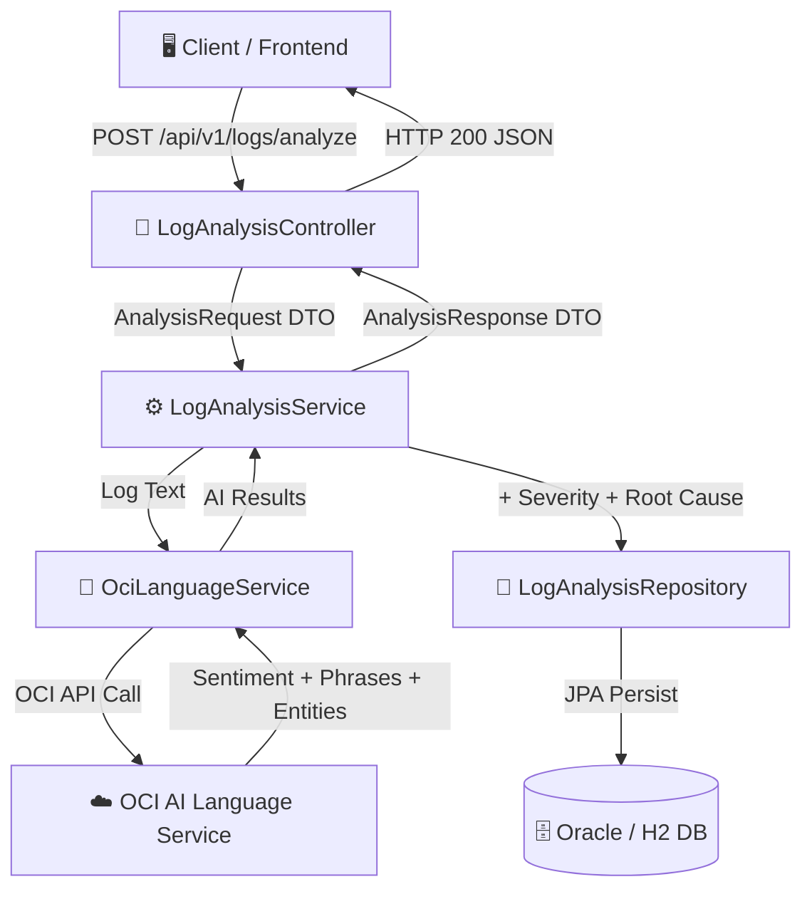

<div align="center">

# 🔍 AI Log Analyzer
### Enterprise Log Intelligence System powered by Oracle Cloud AI

<br/>

[](https://openjdk.org/projects/jdk/21/)
[](https://spring.io/projects/spring-boot)
[](https://www.oracle.com/artificial-intelligence/language/)
[](https://maven.apache.org/)
[](https://www.h2database.com/)
[](LICENSE)

<br/>

> **Stop guessing. Start understanding.**  
> Feed raw application logs into a production-grade AI engine that classifies severity, detects root causes, and extracts key entities — all powered by **Oracle Cloud Infrastructure AI Language Services**.

<br/>

[🚀 Quick Start](#️-setup--installation) &nbsp;·&nbsp; [📖 API Docs](#-api-documentation) &nbsp;·&nbsp; [🧪 Mock Mode](#-mock-mode) &nbsp;·&nbsp; [🏗 Architecture](#-architecture) &nbsp;·&nbsp; [🤝 Contributing](#-contributing)

<br/>

</div>

---

## 📋 Table of Contents

- [✨ Features](#-features)
- [🏗 Architecture](#-architecture)
- [🧠 How OCI AI Language Works](#-how-oci-ai-language-works)
- [📁 Project Structure](#-project-structure)
- [⚙️ Setup & Installation](#️-setup--installation)
- [🔌 API Documentation](#-api-documentation)
- [🧪 Mock Mode](#-mock-mode)
- [📟 Quick Test with curl](#-quick-test-with-curl)
- [🔮 Future Improvements](#-future-improvements)
- [📚 What I Learned](#-what-i-learned)
- [🤝 Contributing](#-contributing)

---

## ✨ Features

<table>
<tr>
<td width="50%">

### 🤖 AI-Powered Analysis
Uses OCI AI Language for **Sentiment Detection**, **Key Phrase Extraction**, and **Named Entity Recognition (NER)** directly on raw log text.

</td>
<td width="50%">

### 🎯 Intelligent Severity Classification
Hybrid approach combining **AI sentiment scores** and **rule-based keyword matching** to classify logs as `INFO`, `WARNING`, `ERROR`, or `CRITICAL`.

</td>
</tr>
<tr>
<td width="50%">

### 💡 Root Cause Hints
Automatically suggests **actionable fix hints** for common error patterns — timeouts, NullPointerExceptions, database failures, and more.

</td>
<td width="50%">

### 🗄️ Persistent History
Every analysis is stored in an **Oracle Database** (or H2 for dev), building a historical audit log for trend analysis and review.

</td>
</tr>
<tr>
<td width="50%">

### 🏢 Enterprise-Grade Architecture
Clean layered architecture: **Controller → Service → OCI Integration → Repository**, with proper DTOs, global exception handling, and Bean Validation.

</td>
<td width="50%">

### 🧪 Zero-Cost Demo Mode
Run the **full application without OCI credentials** using built-in Mock Mode — perfect for local dev, demos, and CI/CD pipelines.

</td>
</tr>
</table>

---

## 🏗 Architecture



### 🛠️ Tech Stack

| Layer | Technology |
|-------|-----------|
| **Language** | Java 21 (LTS) |
| **Framework** | Spring Boot 3.2 (Web, Data JPA, Validation, Actuator) |
| **AI Integration** | OCI Java SDK `oci-java-sdk-ailanguage` v3.30.0 |
| **Database (Prod)** | Oracle Database — OJDBC11 |
| **Database (Dev)** | H2 In-Memory |
| **Build Tool** | Apache Maven 3.8+ |
| **Boilerplate** | Lombok 1.18.36 (Java 21 compatible) |
| **Observability** | Spring Boot Actuator (`/actuator/health`) |

---

## 🧠 How OCI AI Language Works

The `OciLanguageService` makes three distinct API calls to Oracle's pre-trained NLP models for every log submission:

```
Raw Log Text
    │
    ├──► 1. Sentiment Analysis       → "Negative" / "Positive" / "Neutral" + confidence score
    │
    ├──► 2. Key Phrase Extraction    → ["Connection timed out", "PayPal API", "5000ms"]
    │
    └──► 3. Named Entity Recognition → ["PayPal"] (Organizations, Dates, Locations, etc.)
```

| OCI Service | What It Detects | Log Analysis Use |
|---|---|---|
| **Sentiment Analysis** | Emotional tone of text | Flags error-prone / negative log lines |
| **Key Phrase Extraction** | Most important n-grams | Highlights the core issue at a glance |
| **Entity Recognition (NER)** | Named real-world entities | Identifies services, times, transaction IDs |

> All three results are combined with deterministic keyword-based severity rules in `LogAnalyzerUtil` to produce a final, well-rounded `AnalysisResponse`.

---

## 📁 Project Structure

```
AI_Log_Analyzer/
├── src/
│   ├── main/
│   │   ├── java/com/samarth/ai/loganalyzer/
│   │   │   ├── LogAnalyzerApplication.java       # Spring Boot entry point
│   │   │   ├── config/
│   │   │   │   ├── OciConfig.java                # OCI SDK client bean setup
│   │   │   │   └── WebConfig.java                # CORS configuration
│   │   │   ├── controller/
│   │   │   │   └── LogAnalysisController.java    # REST endpoints
│   │   │   ├── exception/
│   │   │   │   └── GlobalExceptionHandler.java   # Centralized error handling
│   │   │   ├── model/
│   │   │   │   ├── AnalysisRequest.java          # Incoming DTO (validated)
│   │   │   │   ├── AnalysisResponse.java         # Outgoing DTO
│   │   │   │   └── LogAnalysis.java              # JPA entity (persisted)
│   │   │   ├── repository/
│   │   │   │   └── LogAnalysisRepository.java    # Spring Data JPA repo
│   │   │   ├── service/
│   │   │   │   ├── LogAnalysisService.java       # Core business logic
│   │   │   │   └── OciLanguageService.java       # OCI AI Language wrapper
│   │   │   └── util/
│   │   │       └── LogAnalyzerUtil.java          # Keyword rules + root-cause hints
│   │   └── resources/
│   │       ├── application.yml                   # Production config (Oracle DB)
│   │       └── application-h2.yml                # Local dev config (H2 DB)
│   └── test/
│       └── java/com/samarth/ai/loganalyzer/
│           └── util/
│               └── LogAnalyzerUtilTest.java       # Unit tests for util layer
└── pom.xml
```

---

## ⚙️ Setup & Installation

### Prerequisites

Before you begin, ensure you have the following installed:

- ☕ **Java 21** — [Download OpenJDK 21](https://adoptium.net/)
- 📦 **Maven 3.8+** — [Download Maven](https://maven.apache.org/download.cgi)
- ☁️ **OCI Account** *(optional — mock mode available)* — [Sign up free](https://cloud.oracle.com/free)
- 🗄️ **Oracle Database** *(optional — H2 available for dev)*

---

### Step 1 — Clone the Repository

```bash
git clone https://github.com/SamarthKapdi/AI-Log-Analyzer.git
cd AI-Log-Analyzer
```

---

### Step 2 — Configure OCI *(Skip for Mock Mode)*

Create your OCI config file at `~/.oci/config` (Linux/macOS) or `%USERPROFILE%\.oci\config` (Windows):

```ini
[DEFAULT]
user=ocid1.user.oc1..aaaaaaa...
fingerprint=xx:xx:xx:...
tenancy=ocid1.tenancy.oc1..aaaaaaa...
region=ap-mumbai-1
key_file=~/.oci/oci_api_key.pem
```

---

### Step 3 — Set Environment Variables

**Linux / macOS:**
```bash
# Required — Oracle Database connection
export DB_URL=jdbc:oracle:thin:@//localhost:1521/XEPDB1
export DB_USERNAME=system
export DB_PASSWORD=your_secure_password

# Required for real OCI calls (skip if using mock mode)
export OCI_COMPARTMENT_ID=ocid1.compartment.oc1..aaaaaaa...

# Optional — enable mock mode for local dev / CI
export OCI_MOCK_MODE=true
```

**Windows (PowerShell):**
```powershell
$env:DB_URL              = "jdbc:oracle:thin:@//localhost:1521/XEPDB1"
$env:DB_USERNAME         = "system"
$env:DB_PASSWORD         = "your_secure_password"
$env:OCI_COMPARTMENT_ID  = "ocid1.compartment.oc1..aaaaaaa..."
$env:OCI_MOCK_MODE       = "true"   # remove for real OCI usage
```

---

### Step 4 — Build & Run

```bash
# Build (skipping tests for a fast start)
mvn clean install -DskipTests

# Run with default profile (Oracle DB)
mvn spring-boot:run

# ─── OR ───

# Run with H2 in-memory DB (no Oracle needed)
mvn spring-boot:run -Dspring-boot.run.profiles=h2
```

> The server starts on **http://localhost:8080** 🎉

---

## 🔌 API Documentation

**Base URL:** `http://localhost:8080/api/v1/logs`

---

### `POST /analyze`

Analyze a single log entry using OCI AI and return structured insights.

**Request Body**

```json
{
  "applicationName": "PaymentGateway",
  "logText": "CRITICAL: Connection timed out while reaching PayPal API after 5000ms. Transaction ID: TXN_12345."
}
```

| Field | Type | Required | Description |
|-------|------|----------|-------------|
| `applicationName` | `String` | ✅ | Name of the source application |
| `logText` | `String` | ✅ | Raw log message to analyze |

**Response — `200 OK`**

```json
{
  "applicationName": "PaymentGateway",
  "detectedSentiment": "Negative",
  "severityClassification": "CRITICAL",
  "confidenceScore": 0.98,
  "keyPhrases": ["Connection timed out", "PayPal API", "5000ms", "Transaction ID"],
  "detectedEntities": ["PayPal", "TXN_12345"],
  "possibleRootCauseHint": "Check network connectivity, firewall rules, or external service availability.",
  "timestamp": "2026-03-05T10:30:00"
}
```

---

### `GET /all`

Retrieve all stored log analyses from the database.

**Response — `200 OK`** — Array of `LogAnalysis` objects with full persistence metadata.

---

### `GET /health`

Simple liveness check for the application.

**Response — `200 OK`**
```
AI Log Analyzer is running. Database and OCI services initialized.
```

---

### `GET /actuator/health`

Spring Boot Actuator health endpoint — checks DB connectivity, disk space, etc.

**Response — `200 OK`**
```json
{
  "status": "UP",
  "components": {
    "db":        { "status": "UP" },
    "diskSpace": { "status": "UP" }
  }
}
```

---

## 🧪 Mock Mode

> **Evaluate this project without an OCI account or credit card.**

Mock Mode bypasses all OCI credential requirements and returns realistic, pre-defined AI inference results, allowing you to fully demo, test, and explore the application at zero cost.

**Enable Mock Mode:**
```bash
export OCI_MOCK_MODE=true          # Linux/macOS
$env:OCI_MOCK_MODE = "true"        # Windows PowerShell
```

**What Mock Mode returns:**
- Sentiment: `"Negative"` with confidence `0.95`
- Key Phrases: `["Mock Error Phrase", "Timeout Mock", "System Failure"]`
- Entities: `["MockService", "MockDB"]`
- All severity classification and root-cause logic still runs normally ✅

### Environment Variable Reference

| Variable | Purpose | Required? |
|---|---|---|
| `OCI_MOCK_MODE` | Enable fallback mock AI responses | No — defaults to `false` |
| `OCI_COMPARTMENT_ID` | OCI tenancy compartment OCID | **Yes** (if `OCI_MOCK_MODE=false`) |
| `OCI_CONFIG_PROFILE` | Profile name in `~/.oci/config` | No — defaults to `DEFAULT` |
| `OCI_CONFIG_FILE` | Path to OCI config file | No — defaults to `~/.oci/config` |
| `DB_URL` | JDBC URL to Oracle DB | No — defaults to `localhost:1521/XEPDB1` |
| `DB_USERNAME` | Oracle DB username | No — defaults to `system` |
| `DB_PASSWORD` | Oracle DB password | **Yes** |
| `CORS_ALLOWED_ORIGINS` | Allowed CORS origins (comma-separated) | No — defaults to `localhost:3000,8080` |

---

## 📟 Quick Test with curl

```bash
# 1. Analyze a critical log entry
curl -X POST http://localhost:8080/api/v1/logs/analyze \
  -H "Content-Type: application/json" \
  -d '{
    "applicationName": "PaymentGateway",
    "logText": "CRITICAL: Connection timed out while reaching PayPal API after 5000ms. Transaction ID: TXN_12345."
  }'

# 2. Analyze an informational log entry
curl -X POST http://localhost:8080/api/v1/logs/analyze \
  -H "Content-Type: application/json" \
  -d '{
    "applicationName": "AuthService",
    "logText": "INFO: User login successful for user@example.com from IP 192.168.1.10."
  }'

# 3. Retrieve all stored analyses
curl http://localhost:8080/api/v1/logs/all

# 4. Application health check
curl http://localhost:8080/api/v1/logs/health

# 5. Spring Actuator health
curl http://localhost:8080/actuator/health
```

---

## 🔮 Future Improvements

- [ ] **Batch Processing** — Endpoint to analyze hundreds of log lines in a single API call
- [ ] **Custom OCI Model** — Train a custom OCI Language model specifically on Java stack traces
- [ ] **Real-time Alerting** — Slack / Email notifications triggered on `CRITICAL` severity
- [ ] **Dashboard** — React-based frontend to visualize log trends and severity over time
- [ ] **Log Streaming** — Kafka consumer to analyze logs in real-time from production systems
- [ ] **Rate Limiting** — API gateway-level throttling to protect OCI usage quotas

---

## 📚 What I Learned

> Building this project deepened my understanding of integrating cutting-edge cloud AI into traditional enterprise Java applications.

- **OCI AI SDK Mastery**: Hands-on with `oci-java-sdk-ailanguage` — Sentiment Analysis, Key Phrase Extraction, and Named Entity Recognition in a real production context.
- **Hybrid AI + Rules**: Combining OCI AI confidence scores with deterministic keyword rules produces far more reliable severity classification than either approach alone.
- **Strict Failure Semantics**: Designed to throw `IllegalStateException` / return `HTTP 503` when OCI credentials are missing — rather than silently falling back — critical for production AI integrations.
- **Clean Architecture under Constraints**: Controller owns HTTP, Service owns orchestration, `OciLanguageService` owns the AI boundary, Repository owns persistence. Zero business logic leaks.
- **Security Discipline**: No secrets in code — all credentials are environment-variable driven. CORS is allowlist-only. Input validated with Bean Validation at the API boundary.

---

## 🤝 Contributing

Contributions are welcome! Here's how to get started:

1. **Fork** this repository
2. **Create** a feature branch: `git checkout -b feature/your-feature-name`
3. **Commit** your changes: `git commit -m 'feat: add amazing feature'`
4. **Push** to your branch: `git push origin feature/your-feature-name`
5. **Open** a Pull Request

Please make sure your code compiles and tests pass (`mvn test`) before submitting.

---

## 📜 License

This project is licensed under the **MIT License** — see the [LICENSE](LICENSE) file for details.

---

<div align="center">

**Built with ❤️ by [Samarth Kapdi](https://github.com/SamarthKapdi)**

⭐ If you found this project useful, please consider giving it a star!

</div>
